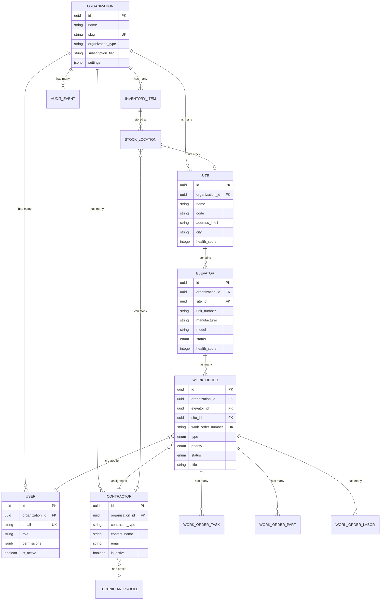

# SiteSync V3 - Entity Relationships

> **How Everything Connects** - Complete entity relationship documentation with diagrams.

---

## Entity Relationship Diagram



---

## Relationship Types

### One-to-Many (1:N)

The most common relationship in SiteSync. One parent has many children.

| Parent | Child | Foreign Key | Notes |
|--------|-------|-------------|-------|
| Organization | Users | `users.organization_id` | Users belong to one org |
| Organization | Sites | `sites.organization_id` | Sites belong to one org |
| Organization | Contractors | `contractors.organization_id` | Contractors belong to one org |
| Organization | Inventory Items | `inventory_items.organization_id` | Inventory belongs to one org |
| Site | Elevators | `elevators.site_id` | Elevators are in one site |
| Elevator | Work Orders | `work_orders.elevator_id` | Work orders are for one elevator |
| Work Order | Tasks | `work_order_tasks.work_order_id` | Tasks belong to one work order |
| Work Order | Parts | `work_order_parts.work_order_id` | Parts used on one work order |
| Work Order | Labor | `work_order_labor.work_order_id` | Labor logged on one work order |
| Inventory Item | Stock Locations | `stock_locations.inventory_item_id` | Stock tracked per location |

### Many-to-One (N:1) References

| Child | Parent | Foreign Key | Nullable | Notes |
|-------|--------|-------------|----------|-------|
| Work Order | Contractor | `assigned_contractor_id` | Yes | Contractor assigned to work |
| Work Order | User | `created_by` | No | Who created the work order |
| Work Order | User | `assigned_by` | Yes | Who assigned the contractor |
| Work Order Labor | Contractor | `contractor_id` | Yes | Who performed labor |
| Stock Location | Contractor | `contractor_id` | Yes | Van stock location |
| Stock Location | Site | `site_id` | Yes | Site stock location |
| Contractor | Technician Profile | `technician_profile_id` | Yes | Platform profile link |

### Self-Referential

| Entity | Relationship | Foreign Key | Notes |
|--------|--------------|-------------|-------|
| Work Order | Parent Work Order | `parent_work_order_id` | Callbacks/follow-ups link to original |

---

## Core Entity Details

### Organization (Tenant Root)

The root of all tenant data. Every other entity belongs to an organization.

```
ORGANIZATION
├── id (UUID, PK)
├── name (VARCHAR 255, NOT NULL)
├── slug (VARCHAR 100, UNIQUE, NOT NULL)
├── organization_type (VARCHAR 50)
│   └── 'service_company' | 'building_owner' | 'manufacturer' |
│       'supplier' | 'insurance' | 'trade_school' | 'regulatory_body' | 'individual'
├── subscription_tier (VARCHAR 50, DEFAULT 'free')
│   └── 'free' | 'pro' | 'expert' | 'enterprise'
├── contact_email (VARCHAR 255)
├── contact_phone (VARCHAR 50)
├── billing_email (VARCHAR 255)
├── settings (JSONB)
│   └── timezone, date_format, currency, ai_enabled, etc.
├── subscription_started_at (TIMESTAMPTZ)
├── subscription_ends_at (TIMESTAMPTZ)
├── trial_ends_at (TIMESTAMPTZ)
├── created_at (TIMESTAMPTZ)
├── updated_at (TIMESTAMPTZ)
└── deleted_at (TIMESTAMPTZ, soft delete)
```

**Children**: Users, Sites, Contractors, Inventory Items, Audit Events

---

### User

People who access the system within an organization.

```
USER
├── id (UUID, PK)
├── organization_id (UUID, FK → organizations.id, NOT NULL)
├── email (VARCHAR 255, NOT NULL)
├── password_hash (VARCHAR 255, NOT NULL)
├── email_verified (BOOLEAN, DEFAULT false)
├── first_name (VARCHAR 100)
├── last_name (VARCHAR 100)
├── phone (VARCHAR 50)
├── avatar_url (VARCHAR 500)
├── role (VARCHAR 50, DEFAULT 'user')
│   └── 'owner' | 'admin' | 'manager' | 'user' | 'technician' | 'readonly'
├── permissions (JSONB, DEFAULT [])
│   └── ["work_orders:create", "work_orders:edit", ...]
├── is_active (BOOLEAN, DEFAULT true)
├── last_login_at (TIMESTAMPTZ)
├── preferences (JSONB)
├── created_at (TIMESTAMPTZ)
├── updated_at (TIMESTAMPTZ)
└── UNIQUE(organization_id, email)
```

**Parent**: Organization
**Referenced By**: Work Orders (created_by, assigned_by), Work Order Tasks (completed_by)

---

### Site (Building)

A physical location containing equipment.

```
SITE
├── id (UUID, PK)
├── organization_id (UUID, FK → organizations.id, NOT NULL)
├── name (VARCHAR 255, NOT NULL)
├── code (VARCHAR 50)
│   └── Short code like "COL-123"
├── address_line1 (VARCHAR 255)
├── address_line2 (VARCHAR 255)
├── city (VARCHAR 100)
├── state (VARCHAR 100)
├── postal_code (VARCHAR 20)
├── country (VARCHAR 100, DEFAULT 'Australia')
├── latitude (DECIMAL 10,8)
├── longitude (DECIMAL 11,8)
├── timezone (VARCHAR 50, DEFAULT 'Australia/Sydney')
├── primary_contact_name (VARCHAR 255)
├── primary_contact_phone (VARCHAR 50)
├── primary_contact_email (VARCHAR 255)
├── emergency_contact_name (VARCHAR 255)
├── emergency_contact_phone (VARCHAR 50)
├── access_instructions (TEXT)
├── access_codes (JSONB, encrypted)
├── building_type (VARCHAR 100)
│   └── 'commercial' | 'residential' | 'mixed' | 'industrial' | ...
├── floors_count (INTEGER)
├── year_built (INTEGER)
├── total_area_sqm (DECIMAL 12,2)
├── health_score (INTEGER 0-100, computed)
├── health_score_updated_at (TIMESTAMPTZ)
├── metadata (JSONB)
├── created_at (TIMESTAMPTZ)
├── updated_at (TIMESTAMPTZ)
└── deleted_at (TIMESTAMPTZ, soft delete)
```

**Parent**: Organization
**Children**: Elevators
**Referenced By**: Work Orders (site_id), Stock Locations (site_id)

---

### Elevator (Asset)

Equipment being managed within a site.

```
ELEVATOR
├── id (UUID, PK)
├── organization_id (UUID, FK → organizations.id, NOT NULL)
├── site_id (UUID, FK → sites.id, NOT NULL)
├── unit_number (VARCHAR 50, NOT NULL)
│   └── "Lift 1", "L1", etc.
├── serial_number (VARCHAR 100)
├── registration_number (VARCHAR 100)
│   └── Government registration
├── asset_tag (VARCHAR 100)
│   └── Internal asset tag
├── manufacturer (VARCHAR 100)
│   └── KONE, Otis, Schindler, etc.
├── model (VARCHAR 100)
├── controller_type (VARCHAR 100)
├── drive_type (VARCHAR 100)
│   └── 'gearless' | 'geared' | 'hydraulic' | 'MRL'
├── machine_type (VARCHAR 100)
├── capacity_kg (INTEGER)
├── capacity_persons (INTEGER)
├── speed_mps (DECIMAL 4,2)
├── floors_served (INTEGER)
├── stops (INTEGER)
├── travel_height_m (DECIMAL 6,2)
├── door_type (VARCHAR 50)
│   └── 'center_opening' | 'side_opening' | 'freight'
├── door_width_mm (INTEGER)
├── car_dimensions (JSONB)
│   └── {"width": 1100, "depth": 1400, "height": 2200}
├── installation_date (DATE)
├── modernization_date (DATE)
├── last_major_service (DATE)
├── status (ENUM elevator_status, DEFAULT 'operational')
│   └── 'operational' | 'degraded' | 'out_of_service' | 'maintenance' | 'decommissioned'
├── status_changed_at (TIMESTAMPTZ)
├── status_reason (TEXT)
├── last_inspection_date (DATE)
├── last_inspection_result (VARCHAR 50)
│   └── 'passed' | 'failed' | 'conditional'
├── next_inspection_due (DATE)
├── inspection_certificate_number (VARCHAR 100)
├── health_score (INTEGER 0-100, computed)
├── health_score_updated_at (TIMESTAMPTZ)
├── v2_document_ids (INTEGER[])
│   └── Links to V2 extracted manuals
├── known_quirks (TEXT[])
│   └── AI-learned equipment-specific notes
├── specifications (JSONB)
│   └── Flexible equipment specs
├── metadata (JSONB)
├── created_at (TIMESTAMPTZ)
├── updated_at (TIMESTAMPTZ)
├── deleted_at (TIMESTAMPTZ, soft delete)
└── UNIQUE(organization_id, site_id, unit_number)
```

**Parents**: Organization, Site
**Children**: Work Orders

---

### Work Order

A job or task to be performed on an elevator.

```
WORK_ORDER
├── id (UUID, PK)
├── organization_id (UUID, FK → organizations.id, NOT NULL)
├── elevator_id (UUID, FK → elevators.id, NOT NULL)
├── site_id (UUID, FK → sites.id, NOT NULL)
├── work_order_number (VARCHAR 50, NOT NULL)
│   └── WO-2024-001234
├── type (ENUM work_order_type, NOT NULL)
│   └── 'breakdown' | 'preventive' | 'inspection' | 'installation' |
│       'modernization' | 'callback' | 'audit'
├── priority (ENUM work_order_priority, DEFAULT 'medium')
│   └── 'emergency' | 'high' | 'medium' | 'low' | 'scheduled'
├── status (ENUM work_order_status, DEFAULT 'draft')
│   └── 'draft' | 'pending' | 'scheduled' | 'in_progress' |
│       'on_hold' | 'completed' | 'cancelled' | 'invoiced'
├── title (VARCHAR 255, NOT NULL)
├── description (TEXT)
├── fault_code (VARCHAR 50)
├── reported_symptoms (TEXT[])
├── affected_floors (INTEGER[])
├── reported_at (TIMESTAMPTZ, DEFAULT NOW())
├── scheduled_start (TIMESTAMPTZ)
├── scheduled_end (TIMESTAMPTZ)
├── actual_start (TIMESTAMPTZ)
├── actual_end (TIMESTAMPTZ)
├── due_date (TIMESTAMPTZ)
├── assigned_contractor_id (UUID, FK → contractors.id)
├── assigned_at (TIMESTAMPTZ)
├── assigned_by (UUID, FK → users.id)
├── reported_by_name (VARCHAR 255)
├── reported_by_phone (VARCHAR 50)
├── reported_by_email (VARCHAR 255)
├── reporter_user_id (UUID, FK → users.id)
├── ai_diagnosis_id (UUID)
├── ai_suggested_causes (TEXT[])
├── ai_suggested_parts (TEXT[])
├── ai_confidence (DECIMAL 3,2)
├── ai_diagnosis_at (TIMESTAMPTZ)
├── resolution_notes (TEXT)
├── root_cause (TEXT)
├── resolution_type (VARCHAR 50)
│   └── 'repaired' | 'replaced' | 'adjusted' | 'cleaned' | 'no_fault_found'
├── parts_cost (DECIMAL 10,2, DEFAULT 0)
├── labor_cost (DECIMAL 10,2, DEFAULT 0)
├── total_cost (DECIMAL 10,2, DEFAULT 0)
├── requires_followup (BOOLEAN, DEFAULT false)
├── followup_notes (TEXT)
├── parent_work_order_id (UUID, FK → work_orders.id)
│   └── Self-reference for callbacks
├── custom_fields (JSONB)
├── created_by (UUID, FK → users.id, NOT NULL)
├── created_at (TIMESTAMPTZ)
├── updated_at (TIMESTAMPTZ)
├── completed_at (TIMESTAMPTZ)
└── UNIQUE(organization_id, work_order_number)
```

**Parents**: Organization, Elevator, Site, Contractor (assigned), User (created_by)
**Children**: Work Order Tasks, Work Order Parts, Work Order Labor
**Self-Reference**: parent_work_order_id → Work Orders

---

### Contractor

Service provider (company or individual).

```
CONTRACTOR
├── id (UUID, PK)
├── organization_id (UUID, FK → organizations.id, NOT NULL)
├── contractor_type (VARCHAR 50, NOT NULL)
│   └── 'employee' | 'subcontractor' | 'vendor' | 'company'
├── company_name (VARCHAR 255)
├── company_abn (VARCHAR 20)
│   └── Australian Business Number
├── company_license (VARCHAR 100)
├── contact_name (VARCHAR 255, NOT NULL)
├── email (VARCHAR 255)
├── phone (VARCHAR 50)
├── address_line1 (VARCHAR 255)
├── city (VARCHAR 100)
├── state (VARCHAR 100)
├── postal_code (VARCHAR 20)
├── license_number (VARCHAR 100)
├── license_expiry (DATE)
├── insurance_policy (VARCHAR 100)
├── insurance_expiry (DATE)
├── specializations (TEXT[])
│   └── ['KONE', 'Otis', 'hydraulic', 'modernization']
├── trade_types (TEXT[])
│   └── ['lifts', 'escalators', 'HVAC']
├── hourly_rate (DECIMAL 10,2)
├── callout_fee (DECIMAL 10,2)
├── emergency_rate_multiplier (DECIMAL 3,2, DEFAULT 1.5)
├── is_active (BOOLEAN, DEFAULT true)
├── is_preferred (BOOLEAN, DEFAULT false)
├── rating (DECIMAL 3,2)
│   └── 0.00-5.00
├── total_jobs_completed (INTEGER, DEFAULT 0)
├── first_time_fix_rate (DECIMAL 5,2)
├── average_response_time_minutes (INTEGER)
├── technician_profile_id (UUID)
│   └── Links to platform-wide profile
├── metadata (JSONB)
├── created_at (TIMESTAMPTZ)
├── updated_at (TIMESTAMPTZ)
└── deleted_at (TIMESTAMPTZ, soft delete)
```

**Parent**: Organization
**Referenced By**: Work Orders (assigned_contractor_id), Work Order Labor (contractor_id), Stock Locations (contractor_id)

---

## Foreign Key Constraints

### Cascade Delete Rules

When a parent is deleted, what happens to children?

| Parent | Child | On Delete | Rationale |
|--------|-------|-----------|-----------|
| Organization | Users | CASCADE | Users can't exist without org |
| Organization | Sites | CASCADE | Sites can't exist without org |
| Organization | Contractors | CASCADE | Contractors can't exist without org |
| Organization | Inventory | CASCADE | Inventory can't exist without org |
| Site | Elevators | CASCADE | Elevators can't exist without site |
| Elevator | Work Orders | RESTRICT | Preserve work history |
| Work Order | Tasks | CASCADE | Tasks are part of work order |
| Work Order | Parts | CASCADE | Parts are part of work order |
| Work Order | Labor | CASCADE | Labor is part of work order |
| Inventory Item | Stock Locations | CASCADE | Stock locations belong to item |

### Nullable Foreign Keys

| Table | Foreign Key | Nullable | Reason |
|-------|-------------|----------|--------|
| work_orders | assigned_contractor_id | Yes | Not always assigned |
| work_orders | assigned_by | Yes | May be auto-assigned |
| work_orders | reporter_user_id | Yes | Reporter may not have account |
| work_orders | parent_work_order_id | Yes | Not a callback |
| work_order_parts | inventory_item_id | Yes | Manual part entry allowed |
| work_order_labor | contractor_id | Yes | May be internal staff |
| stock_locations | contractor_id | Yes | Only for van stock |
| stock_locations | site_id | Yes | Only for site stock |
| contractors | technician_profile_id | Yes | May not have platform profile |

---

## Index Strategy

### Primary Indexes

Every table has:
- Primary key index (UUID)
- Organization ID index (for RLS filtering)

### Foreign Key Indexes

All foreign keys are indexed for join performance:

```sql
CREATE INDEX idx_sites_org ON sites(organization_id);
CREATE INDEX idx_elevators_site ON elevators(site_id);
CREATE INDEX idx_work_orders_elevator ON work_orders(elevator_id);
CREATE INDEX idx_work_orders_contractor ON work_orders(assigned_contractor_id);
```

### Query Optimization Indexes

```sql
-- Status filtering (most common queries)
CREATE INDEX idx_work_orders_status ON work_orders(status);
CREATE INDEX idx_elevators_status ON elevators(status);
CREATE INDEX idx_contractors_active ON contractors(is_active) WHERE is_active = true;

-- Date range queries
CREATE INDEX idx_work_orders_dates ON work_orders(scheduled_start, due_date);
CREATE INDEX idx_elevators_inspection ON elevators(next_inspection_due);

-- Text search
CREATE INDEX idx_work_orders_number ON work_orders(work_order_number);

-- Array searches (GIN indexes)
CREATE INDEX idx_contractors_specs ON contractors USING GIN(specializations);
CREATE INDEX idx_inventory_compat ON inventory_items USING GIN(compatible_manufacturers);

-- Geospatial
CREATE INDEX idx_sites_location ON sites USING GIST (
    point(longitude, latitude)
) WHERE latitude IS NOT NULL;
```

---

## Row-Level Security Policies

All tenant-scoped tables have RLS enabled:

```sql
-- Enable RLS
ALTER TABLE sites ENABLE ROW LEVEL SECURITY;
ALTER TABLE elevators ENABLE ROW LEVEL SECURITY;
ALTER TABLE contractors ENABLE ROW LEVEL SECURITY;
ALTER TABLE work_orders ENABLE ROW LEVEL SECURITY;
ALTER TABLE users ENABLE ROW LEVEL SECURITY;
-- ... all other tables

-- Isolation policies
CREATE POLICY org_isolation ON sites
    USING (organization_id = current_setting('app.current_org')::uuid);

CREATE POLICY org_isolation ON elevators
    USING (organization_id = current_setting('app.current_org')::uuid);

-- For child tables without organization_id, use subquery
CREATE POLICY org_isolation ON work_order_tasks
    USING (work_order_id IN (
        SELECT id FROM work_orders
        WHERE organization_id = current_setting('app.current_org')::uuid
    ));
```

---

## Subject Areas (Logical Groupings)

Entities are grouped into logical domains:

### Core Operations
- Organizations
- Users
- Sites
- Elevators

### Work Management
- Work Orders
- Work Order Tasks
- Work Order Parts
- Work Order Labor

### Workforce
- Contractors
- Technician Profiles
- Profile Certifications

### Inventory
- Inventory Items
- Stock Locations
- Stock Transactions

### Platform Services
- Marketplace Listings
- Knowledge Contributions
- Audit Events

---

## Entity Creation Order

Entities must be created in this order due to foreign key dependencies:

```
1. ORGANIZATION (root - no dependencies)
   │
   ├─► 2a. USERS (depends on Organization)
   │
   ├─► 2b. SITES (depends on Organization)
   │       │
   │       └─► 3. ELEVATORS (depends on Site)
   │               │
   │               └─► 4. WORK ORDERS (depends on Elevator)
   │                       │
   │                       ├─► 5a. WORK ORDER TASKS
   │                       ├─► 5b. WORK ORDER PARTS
   │                       └─► 5c. WORK ORDER LABOR
   │
   ├─► 2c. CONTRACTORS (depends on Organization)
   │
   └─► 2d. INVENTORY ITEMS (depends on Organization)
           │
           └─► 3. STOCK LOCATIONS (depends on Inventory Item)
```

---

## Quick Reference: Key Relationships

| I want to... | Query Pattern |
|--------------|---------------|
| Get all sites for an org | `SELECT * FROM sites WHERE organization_id = ?` |
| Get all elevators in a site | `SELECT * FROM elevators WHERE site_id = ?` |
| Get all work orders for an elevator | `SELECT * FROM work_orders WHERE elevator_id = ?` |
| Get work order with details | Join work_orders → elevator → site |
| Get contractor's active jobs | `SELECT * FROM work_orders WHERE assigned_contractor_id = ? AND status IN ('scheduled', 'in_progress')` |
| Get site health | Aggregate elevator health scores |
| Get parts used on work order | `SELECT * FROM work_order_parts WHERE work_order_id = ?` |
| Get van stock for contractor | `SELECT * FROM stock_locations WHERE contractor_id = ? AND location_type = 'van'` |

---

**[← Previous: System Overview](01-system-overview.md)** | **[Next: Organization Profiles →](03-organization-profiles.md)**
