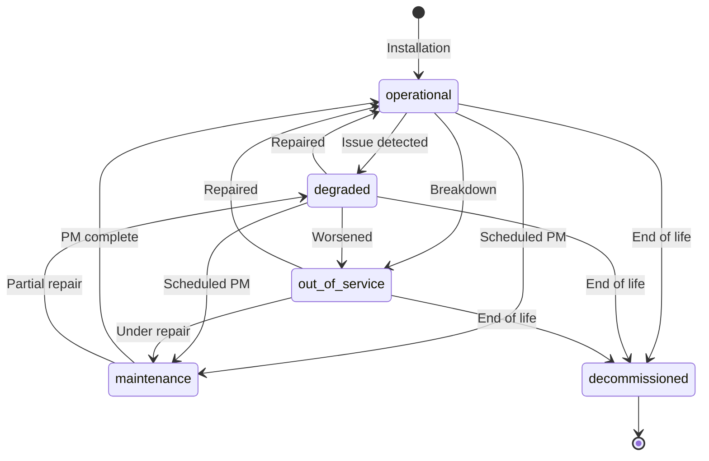

# SiteSync V3 - Asset Profiles

> **Elevator/Equipment Data Model** - Complete specification for asset profiles.

---

## What is an Asset?

An **Asset** (currently Elevator) represents a piece of equipment being managed within a Site. Assets:

- Belong to one Site (and therefore one Organization)
- Have work orders performed on them
- Have health scores based on condition and maintenance
- Store equipment specifications and compliance data
- Link to AI-learned quirks and documentation

---

## Asset Status Types

| Status | Code | Description | Work Allowed |
|--------|------|-------------|--------------|
| **Operational** | `operational` | Running normally | Yes (preventive) |
| **Degraded** | `degraded` | Running with issues | Yes (corrective) |
| **Out of Service** | `out_of_service` | Not running | Yes (breakdown) |
| **Maintenance** | `maintenance` | Scheduled maintenance | Yes (in progress) |
| **Decommissioned** | `decommissioned` | No longer in use | No |



---

## Profile Field Reference

### Required Fields

| Field | Type | Constraints | Description |
|-------|------|-------------|-------------|
| `organization_id` | UUID | FK, NOT NULL | Parent organization |
| `site_id` | UUID | FK, NOT NULL | Parent site |
| `unit_number` | VARCHAR(50) | NOT NULL | Display identifier |

### Identity Fields

| Field | Type | Required | Description | Example |
|-------|------|----------|-------------|---------|
| `id` | UUID | Auto | Primary key | UUID |
| `organization_id` | UUID | Yes | Parent organization | UUID |
| `site_id` | UUID | Yes | Parent site | UUID |
| `unit_number` | VARCHAR(50) | Yes | Display identifier | "Lift 1" |
| `serial_number` | VARCHAR(100) | Recommended | Manufacturer serial | "KM-2015-78234" |
| `registration_number` | VARCHAR(100) | Recommended | Government registration | "EL-VIC-12345" |
| `asset_tag` | VARCHAR(100) | No | Internal asset tag | "CLS-ELV-001" |

### Equipment Details

| Field | Type | Required | Description | Example |
|-------|------|----------|-------------|---------|
| `manufacturer` | VARCHAR(100) | Recommended | Manufacturer name | "KONE" |
| `model` | VARCHAR(100) | Recommended | Model name | "MonoSpace 500" |
| `controller_type` | VARCHAR(100) | No | Controller type | "KCM" |
| `drive_type` | VARCHAR(100) | No | Drive type | "EcoDisc" |
| `machine_type` | VARCHAR(100) | No | Machine type | "Gearless" |

### Specifications

| Field | Type | Required | Description | Example |
|-------|------|----------|-------------|---------|
| `capacity_kg` | INTEGER | Recommended | Load capacity | 1000 |
| `capacity_persons` | INTEGER | No | Person capacity | 13 |
| `speed_mps` | DECIMAL(4,2) | Recommended | Speed m/s | 1.60 |
| `floors_served` | INTEGER | Recommended | Floors served | 12 |
| `stops` | INTEGER | No | Number of stops | 12 |
| `travel_height_m` | DECIMAL(6,2) | No | Travel height | 45.00 |
| `door_type` | VARCHAR(50) | No | Door opening type | "center_opening" |
| `door_width_mm` | INTEGER | No | Door width | 900 |
| `car_dimensions` | JSONB | No | Car dimensions | `{"width": 1100, ...}` |

### Date Fields

| Field | Type | Required | Description | Example |
|-------|------|----------|-------------|---------|
| `installation_date` | DATE | Recommended | Install date | "2015-06-15" |
| `modernization_date` | DATE | No | Last modernization | "2022-03-01" |
| `last_major_service` | DATE | No | Last major service | "2024-06-15" |

### Status Fields

| Field | Type | Required | Description | Example |
|-------|------|----------|-------------|---------|
| `status` | ENUM | No (default) | Current status | "operational" |
| `status_changed_at` | TIMESTAMPTZ | Auto | Status change time | "2024-12-01T..." |
| `status_reason` | TEXT | No | Reason for status | "Door fault" |

### Compliance Fields

| Field | Type | Required | Description | Example |
|-------|------|----------|-------------|---------|
| `last_inspection_date` | DATE | Recommended | Last inspection | "2024-06-01" |
| `last_inspection_result` | VARCHAR(50) | No | Inspection result | "passed" |
| `next_inspection_due` | DATE | Recommended | Next due date | "2025-06-01" |
| `inspection_certificate_number` | VARCHAR(100) | No | Certificate number | "CERT-2024-12345" |

### Health Fields

| Field | Type | Required | Description | Example |
|-------|------|----------|-------------|---------|
| `health_score` | INTEGER | Computed | Health 0-100 | 92 |
| `health_score_updated_at` | TIMESTAMPTZ | Computed | Last calculation | "2024-12-01T..." |

### AI/Knowledge Fields

| Field | Type | Required | Description | Example |
|-------|------|----------|-------------|---------|
| `v2_document_ids` | INTEGER[] | No | V2 document links | [101, 102, 105] |
| `known_quirks` | TEXT[] | No | AI-learned notes | ["Door sensor sensitive..."] |

### Flexible Fields

| Field | Type | Required | Description |
|-------|------|----------|-------------|
| `specifications` | JSONB | No | Additional specs |
| `metadata` | JSONB | No | Additional data |

### System Fields

| Field | Type | Required | Description |
|-------|------|----------|-------------|
| `created_at` | TIMESTAMPTZ | Auto | Creation timestamp |
| `updated_at` | TIMESTAMPTZ | Auto | Last update |
| `deleted_at` | TIMESTAMPTZ | No | Soft delete |

---

## Door Types

| Type | Code | Description |
|------|------|-------------|
| Center Opening | `center_opening` | Doors open from center |
| Side Opening | `side_opening` | Doors open to one side |
| Two Speed | `two_speed` | Combined opening types |
| Freight | `freight` | Vertical bi-parting doors |

---

## Drive Types

| Type | Code | Description |
|------|------|-------------|
| Gearless | `gearless` | Direct drive, no gearbox |
| Geared | `geared` | Traditional geared machine |
| Hydraulic | `hydraulic` | Hydraulic jack system |
| MRL | `mrl` | Machine Room Less |

---

## Car Dimensions Schema

```json
{
  "width": 1100,
  "depth": 1400,
  "height": 2200,
  "door_height": 2100,
  "clear_opening_width": 900,
  "clear_opening_depth": 1300
}
```

All measurements in millimeters.

---

## Specifications Schema

The `specifications` field stores flexible equipment data:

```json
{
  "rope_count": 6,
  "rope_diameter_mm": 10,
  "rope_construction": "8x19 Seale",
  "buffer_type": "spring",
  "buffer_stroke_mm": 150,
  "governor_type": "centrifugal",
  "governor_speed_mps": 1.75,
  "safety_gear_type": "progressive",
  "counterweight_ratio": 0.5,
  "motor_power_kw": 11.5,
  "motor_voltage": 415,
  "motor_phases": 3,
  "motor_frequency_hz": 50,
  "controller_software_version": "4.2.1",
  "door_operator": "VVVF",
  "door_operator_manufacturer": "KONE",
  "car_lighting": "LED",
  "ventilation": "forced",
  "intercom": "3G",
  "destination_dispatch": false
}
```

---

## Known Quirks

AI-learned equipment-specific notes:

```json
[
  "Door B-side sensor requires recalibration every 6 months",
  "Controller reboot required if fault code E15 persists after clearing",
  "Car fan makes noise at high speed - normal for this unit",
  "Load weighing device reads 5% high - compensation applied",
  "Building power fluctuations cause occasional E07 faults"
]
```

These are automatically populated by AI analysis of work order history and technician notes.

---

## Creation Requirements

### Minimum Required Data

```json
{
  "site_id": "550e8400-e29b-41d4-a716-446655440001",
  "unit_number": "Lift 1"
}
```

**Note**: `organization_id` is automatically set from authentication context.

### Recommended Data

```json
{
  "site_id": "550e8400-e29b-41d4-a716-446655440001",
  "unit_number": "Lift 1",
  "serial_number": "KM-2015-78234",
  "registration_number": "EL-VIC-12345",
  "manufacturer": "KONE",
  "model": "MonoSpace 500",
  "capacity_kg": 1000,
  "speed_mps": 1.6,
  "floors_served": 12,
  "installation_date": "2015-06-15"
}
```

---

## Profile Completeness Levels

### Minimal Profile

```json
{
  "id": "550e8400-e29b-41d4-a716-446655440003",
  "organization_id": "550e8400-e29b-41d4-a716-446655440000",
  "site_id": "550e8400-e29b-41d4-a716-446655440001",
  "unit_number": "Lift 1",
  "status": "operational",
  "status_changed_at": "2024-12-01T10:00:00Z",
  "specifications": {},
  "metadata": {},
  "created_at": "2024-12-01T10:00:00Z",
  "updated_at": "2024-12-01T10:00:00Z"
}
```

**Completeness**: ~10%

### Standard Profile

```json
{
  "id": "550e8400-e29b-41d4-a716-446655440003",
  "organization_id": "550e8400-e29b-41d4-a716-446655440000",
  "site_id": "550e8400-e29b-41d4-a716-446655440001",
  "unit_number": "Lift 1",
  "serial_number": "KM-2015-78234",
  "registration_number": "EL-VIC-12345",
  "manufacturer": "KONE",
  "model": "MonoSpace 500",
  "controller_type": "KCM",
  "drive_type": "EcoDisc",
  "capacity_kg": 1000,
  "capacity_persons": 13,
  "speed_mps": 1.60,
  "floors_served": 12,
  "door_type": "center_opening",
  "installation_date": "2015-06-15",
  "status": "operational",
  "status_changed_at": "2024-12-01T10:00:00Z",
  "last_inspection_date": "2024-06-01",
  "last_inspection_result": "passed",
  "next_inspection_due": "2025-06-01",
  "health_score": 92,
  "health_score_updated_at": "2024-12-01T06:00:00Z",
  "created_at": "2024-01-01T10:00:00Z",
  "updated_at": "2024-12-01T10:00:00Z"
}
```

**Completeness**: ~50%

### Complete Profile

```json
{
  "id": "550e8400-e29b-41d4-a716-446655440003",
  "organization_id": "550e8400-e29b-41d4-a716-446655440000",
  "site_id": "550e8400-e29b-41d4-a716-446655440001",
  "unit_number": "Lift 1",
  "serial_number": "KM-2015-78234",
  "registration_number": "EL-VIC-12345",
  "asset_tag": "CLS-ELV-001",
  "manufacturer": "KONE",
  "model": "MonoSpace 500",
  "controller_type": "KCM",
  "drive_type": "EcoDisc",
  "machine_type": "Gearless",
  "capacity_kg": 1000,
  "capacity_persons": 13,
  "speed_mps": 1.60,
  "floors_served": 12,
  "stops": 12,
  "travel_height_m": 45.00,
  "door_type": "center_opening",
  "door_width_mm": 900,
  "car_dimensions": {
    "width": 1100,
    "depth": 1400,
    "height": 2200
  },
  "installation_date": "2015-06-15",
  "modernization_date": "2022-03-01",
  "last_major_service": "2024-06-15",
  "status": "operational",
  "status_changed_at": "2024-12-01T10:00:00Z",
  "status_reason": null,
  "last_inspection_date": "2024-06-01",
  "last_inspection_result": "passed",
  "next_inspection_due": "2025-06-01",
  "inspection_certificate_number": "CERT-2024-12345",
  "health_score": 92,
  "health_score_updated_at": "2024-12-01T06:00:00Z",
  "v2_document_ids": [101, 102, 105],
  "known_quirks": [
    "Door B-side sensor requires recalibration every 6 months",
    "Controller reboot required if fault code E15 persists"
  ],
  "specifications": {
    "rope_count": 6,
    "rope_diameter_mm": 10,
    "buffer_type": "spring",
    "governor_type": "centrifugal",
    "motor_power_kw": 11.5,
    "motor_voltage": 415,
    "controller_software_version": "4.2.1"
  },
  "metadata": {
    "original_contractor": "KONE Australia",
    "warranty_expires": "2020-06-15",
    "modernization_scope": "Controller and door operators"
  },
  "created_at": "2024-01-01T10:00:00Z",
  "updated_at": "2024-12-01T10:00:00Z"
}
```

**Completeness**: 100%

---

## Health Score Calculation

The asset health score (0-100) is calculated from:

| Factor | Weight | Description |
|--------|--------|-------------|
| Age factor | 20% | Based on installation date |
| Maintenance history | 25% | On-time PM completion |
| Breakdown frequency | 25% | Breakdowns per month |
| Inspection status | 15% | Current inspection status |
| Known issues | 15% | Open work orders count |

```
Health = (age_score × 0.20) +
         (maintenance_score × 0.25) +
         (breakdown_score × 0.25) +
         (inspection_score × 0.15) +
         (issues_score × 0.15)
```

---

## Related Entities

| Entity | Relationship | Description |
|--------|--------------|-------------|
| Site | N:1 | Parent building |
| Work Orders | 1:N | Jobs on this asset |
| Documents | 1:N | Linked documentation |

---

## Validation Rules

| Field | Rule | Error Message |
|-------|------|---------------|
| `unit_number` | Required, 1-50 chars | "Unit number is required" |
| `unit_number` | Unique per site | "Unit number already exists at this site" |
| `serial_number` | 1-100 chars | "Serial number too long" |
| `capacity_kg` | Positive integer | "Capacity must be positive" |
| `capacity_persons` | Positive integer | "Capacity must be positive" |
| `speed_mps` | Positive decimal | "Speed must be positive" |
| `floors_served` | Positive integer | "Floors must be positive" |
| `installation_date` | Valid date, not future | "Invalid installation date" |
| `status` | One of defined statuses | "Invalid status" |
| `last_inspection_result` | passed/failed/conditional | "Invalid inspection result" |

---

## Asset Hierarchy (Future)

Currently, elevators are treated as atomic units. Future expansion could add component sub-assets:

```
ELEVATOR (Parent Asset)
├── DOOR_OPERATOR (Component)
│   ├── serial_number
│   ├── manufacturer
│   └── installation_date
├── CONTROLLER (Component)
│   ├── serial_number
│   ├── software_version
│   └── installation_date
├── DRIVE_MACHINE (Component)
│   ├── serial_number
│   ├── motor_type
│   └── installation_date
└── SAFETY_GEAR (Component)
    ├── serial_number
    ├── type
    └── last_test_date
```

Currently, component data is stored in the `specifications` JSONB field.

---

## Pydantic Models

```python
from datetime import date, datetime
from decimal import Decimal
from uuid import UUID
from enum import Enum
from pydantic import BaseModel, Field

class ElevatorStatus(str, Enum):
    OPERATIONAL = "operational"
    DEGRADED = "degraded"
    OUT_OF_SERVICE = "out_of_service"
    MAINTENANCE = "maintenance"
    DECOMMISSIONED = "decommissioned"

class Elevator(BaseModel):
    """Elevator/Asset domain model."""

    id: UUID
    organization_id: UUID
    site_id: UUID

    # Identity
    unit_number: str
    serial_number: str | None = None
    registration_number: str | None = None
    asset_tag: str | None = None

    # Equipment
    manufacturer: str | None = None
    model: str | None = None
    controller_type: str | None = None
    drive_type: str | None = None
    machine_type: str | None = None

    # Specs
    capacity_kg: int | None = None
    capacity_persons: int | None = None
    speed_mps: Decimal | None = None
    floors_served: int | None = None
    stops: int | None = None
    travel_height_m: Decimal | None = None
    door_type: str | None = None
    door_width_mm: int | None = None
    car_dimensions: dict | None = None

    # Dates
    installation_date: date | None = None
    modernization_date: date | None = None
    last_major_service: date | None = None

    # Status
    status: ElevatorStatus = ElevatorStatus.OPERATIONAL
    status_changed_at: datetime
    status_reason: str | None = None

    # Compliance
    last_inspection_date: date | None = None
    last_inspection_result: str | None = None
    next_inspection_due: date | None = None
    inspection_certificate_number: str | None = None

    # Health
    health_score: int | None = None
    health_score_updated_at: datetime | None = None

    # AI
    v2_document_ids: list[int] = Field(default_factory=list)
    known_quirks: list[str] = Field(default_factory=list)

    # Flexible
    specifications: dict = Field(default_factory=dict)
    metadata: dict = Field(default_factory=dict)

    # Timestamps
    created_at: datetime
    updated_at: datetime


class ElevatorCreate(BaseModel):
    """Create elevator request."""

    site_id: UUID
    unit_number: str = Field(..., min_length=1, max_length=50)
    serial_number: str | None = None
    registration_number: str | None = None
    manufacturer: str | None = None
    model: str | None = None
    capacity_kg: int | None = None
    speed_mps: Decimal | None = None
    floors_served: int | None = None
    installation_date: date | None = None
    specifications: dict = Field(default_factory=dict)


class ElevatorUpdate(BaseModel):
    """Update elevator request."""

    unit_number: str | None = Field(None, min_length=1, max_length=50)
    serial_number: str | None = None
    registration_number: str | None = None
    manufacturer: str | None = None
    model: str | None = None
    controller_type: str | None = None
    drive_type: str | None = None
    capacity_kg: int | None = None
    speed_mps: Decimal | None = None
    floors_served: int | None = None
    status: ElevatorStatus | None = None
    status_reason: str | None = None
    specifications: dict | None = None
```

---

**[← Previous: User Profiles](05-user-profiles.md)** | **[Next: Creation Flows →](07-creation-flows.md)**
