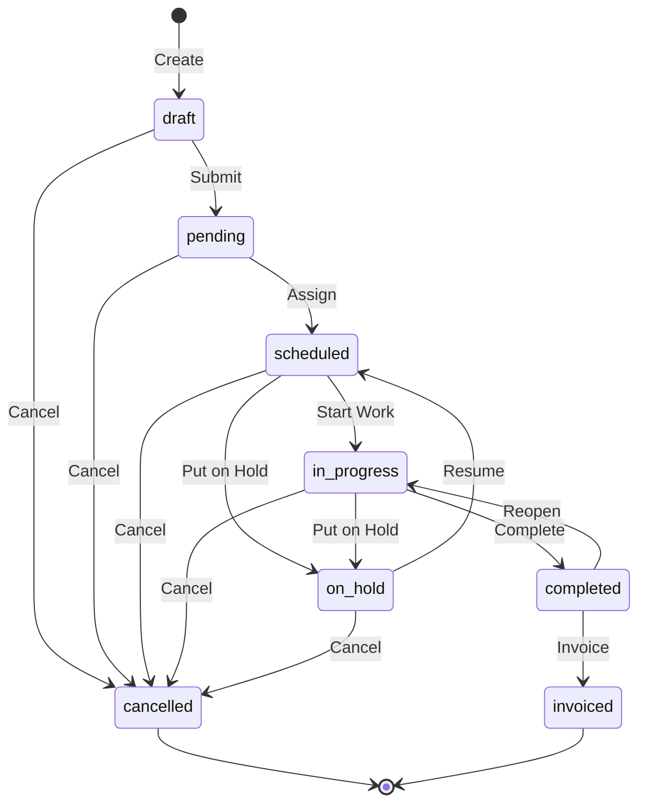
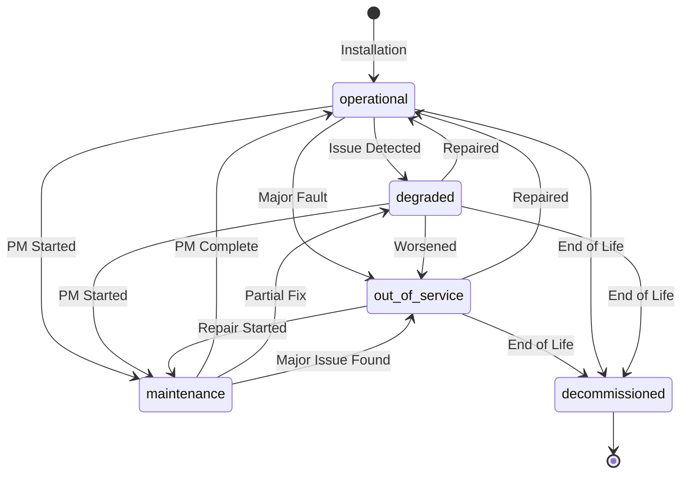
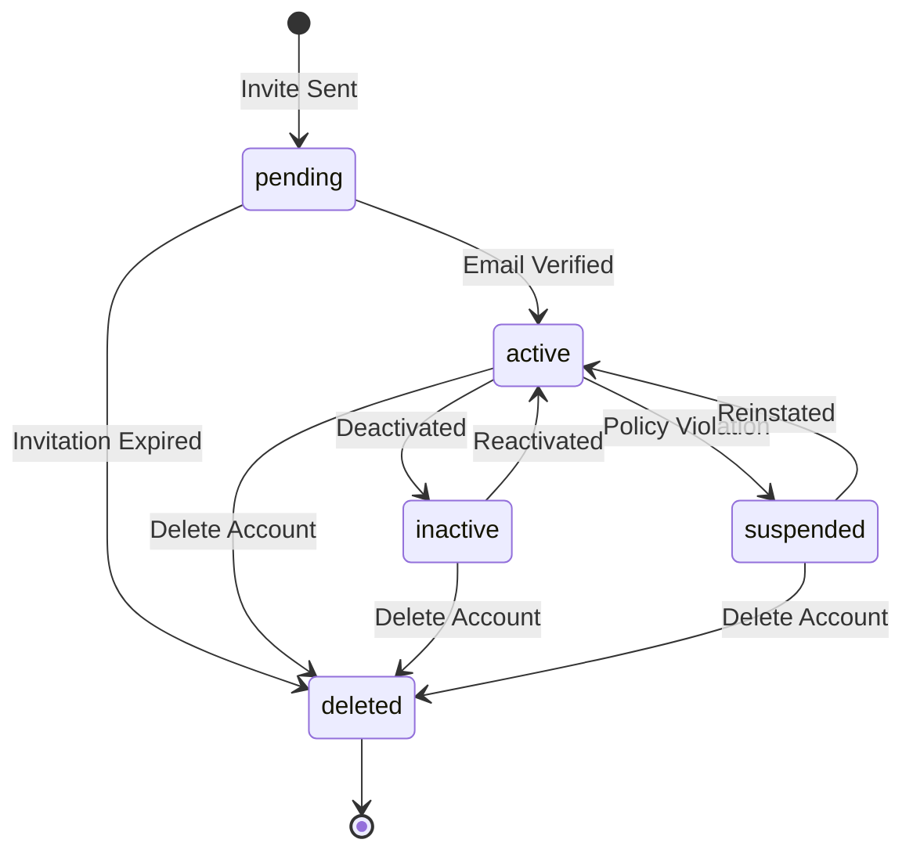
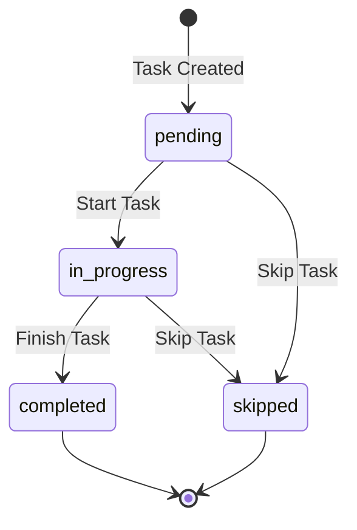
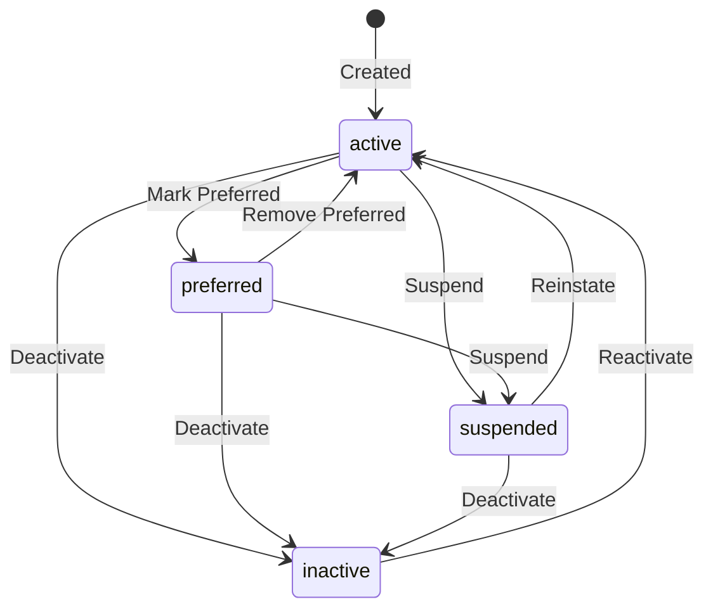
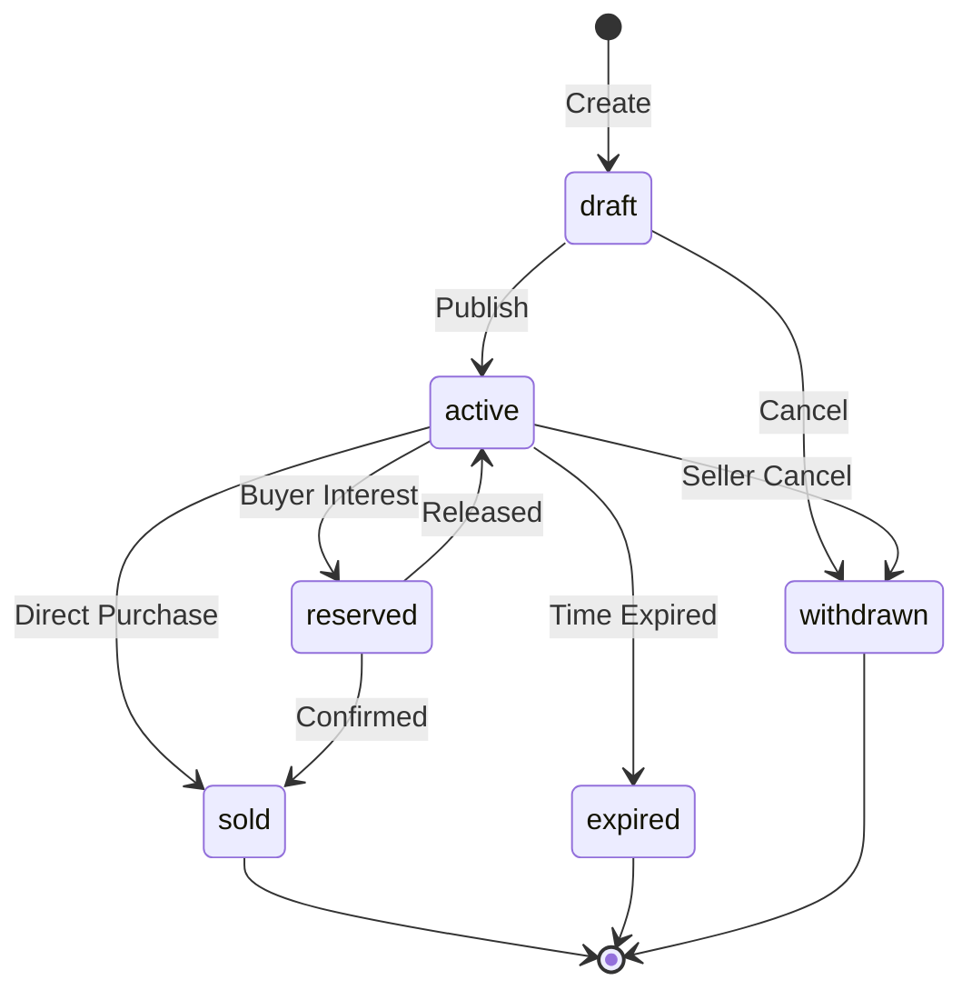

# SiteSync V3 - State Machines

> **Status Transitions** - Complete state machine documentation for all entities.

---

## Overview

State machines define:
- Valid **states** an entity can be in
- Valid **transitions** between states
- **Who** can trigger each transition
- **Actions** that occur on transition
- **Validation** required for transitions

---

## Work Order State Machine

### States

| State | Code | Description |
|-------|------|-------------|
| **Draft** | `draft` | Created but not submitted |
| **Pending** | `pending` | Submitted, awaiting assignment |
| **Scheduled** | `scheduled` | Assigned and scheduled |
| **In Progress** | `in_progress` | Work actively being done |
| **On Hold** | `on_hold` | Temporarily paused |
| **Completed** | `completed` | Work finished |
| **Cancelled** | `cancelled` | Cancelled before completion |
| **Invoiced** | `invoiced` | Invoiced and closed |

### State Diagram



### Transition Rules

| From | To | Who Can Trigger | Requirements |
|------|----|-----------------|--------------|
| `draft` | `pending` | Creator, Manager+ | Title required |
| `draft` | `cancelled` | Creator, Manager+ | None |
| `pending` | `scheduled` | Manager+ | Contractor assigned |
| `pending` | `cancelled` | Manager+ | Reason required |
| `scheduled` | `in_progress` | Technician, Manager+ | None |
| `scheduled` | `on_hold` | Manager+ | Reason required |
| `scheduled` | `cancelled` | Manager+ | Reason required |
| `in_progress` | `completed` | Technician, Manager+ | Resolution notes |
| `in_progress` | `on_hold` | Manager+ | Reason required |
| `in_progress` | `cancelled` | Manager+ | Reason required |
| `on_hold` | `scheduled` | Manager+ | None |
| `on_hold` | `cancelled` | Manager+ | None |
| `completed` | `invoiced` | Manager+ | Costs finalized |
| `completed` | `in_progress` | Manager+ | Reason (callback) |

### Actions on Transition

| Transition | Actions |
|------------|---------|
| → `pending` | Notify managers, update reported_at |
| → `scheduled` | Notify contractor, set scheduled_start |
| → `in_progress` | Set actual_start, update elevator status |
| → `on_hold` | Notify stakeholders, pause SLA clock |
| → `completed` | Set actual_end, calculate costs, update elevator health |
| → `cancelled` | Notify stakeholders, log reason |
| → `invoiced` | Lock work order, archive |

### Implementation

```python
from enum import Enum
from typing import Set

class WorkOrderStatus(str, Enum):
    DRAFT = "draft"
    PENDING = "pending"
    SCHEDULED = "scheduled"
    IN_PROGRESS = "in_progress"
    ON_HOLD = "on_hold"
    COMPLETED = "completed"
    CANCELLED = "cancelled"
    INVOICED = "invoiced"

# Valid transitions
WORK_ORDER_TRANSITIONS: dict[WorkOrderStatus, Set[WorkOrderStatus]] = {
    WorkOrderStatus.DRAFT: {
        WorkOrderStatus.PENDING,
        WorkOrderStatus.CANCELLED,
    },
    WorkOrderStatus.PENDING: {
        WorkOrderStatus.SCHEDULED,
        WorkOrderStatus.CANCELLED,
    },
    WorkOrderStatus.SCHEDULED: {
        WorkOrderStatus.IN_PROGRESS,
        WorkOrderStatus.ON_HOLD,
        WorkOrderStatus.CANCELLED,
    },
    WorkOrderStatus.IN_PROGRESS: {
        WorkOrderStatus.COMPLETED,
        WorkOrderStatus.ON_HOLD,
        WorkOrderStatus.CANCELLED,
    },
    WorkOrderStatus.ON_HOLD: {
        WorkOrderStatus.SCHEDULED,
        WorkOrderStatus.CANCELLED,
    },
    WorkOrderStatus.COMPLETED: {
        WorkOrderStatus.INVOICED,
        WorkOrderStatus.IN_PROGRESS,  # Reopen
    },
    WorkOrderStatus.CANCELLED: set(),  # Terminal
    WorkOrderStatus.INVOICED: set(),   # Terminal
}

def can_transition(
    current: WorkOrderStatus,
    target: WorkOrderStatus,
) -> bool:
    """Check if transition is valid."""
    return target in WORK_ORDER_TRANSITIONS.get(current, set())

def validate_transition(
    work_order: WorkOrder,
    target: WorkOrderStatus,
    user: User,
) -> list[str]:
    """Validate transition and return any errors."""
    errors = []

    # Check valid transition
    if not can_transition(work_order.status, target):
        errors.append(
            f"Cannot transition from {work_order.status} to {target}"
        )

    # Role-based checks
    if target == WorkOrderStatus.SCHEDULED:
        if not work_order.assigned_contractor_id:
            errors.append("Contractor must be assigned")

    if target == WorkOrderStatus.COMPLETED:
        if not work_order.resolution_notes:
            errors.append("Resolution notes required")
        if user.role == "technician":
            if work_order.assigned_contractor_id != user.contractor_id:
                errors.append("Can only complete own assigned work")

    if target in {WorkOrderStatus.CANCELLED, WorkOrderStatus.ON_HOLD}:
        if user.role not in {"owner", "admin", "manager"}:
            errors.append("Only managers can cancel or hold work orders")

    return errors
```

---

## Elevator Status State Machine

### States

| State | Code | Description |
|-------|------|-------------|
| **Operational** | `operational` | Running normally |
| **Degraded** | `degraded` | Running with issues |
| **Out of Service** | `out_of_service` | Not running |
| **Maintenance** | `maintenance` | Under maintenance |
| **Decommissioned** | `decommissioned` | Permanently out of use |

### State Diagram



### Transition Rules

| From | To | Trigger | Who |
|------|----|---------| --- |
| `operational` | `degraded` | Issue detected | Manager+, System |
| `operational` | `out_of_service` | Major fault/breakdown | Manager+, System |
| `operational` | `maintenance` | PM work order started | System |
| `operational` | `decommissioned` | End of life | Admin+ |
| `degraded` | `operational` | Repair completed | Manager+, System |
| `degraded` | `out_of_service` | Condition worsened | Manager+, System |
| `degraded` | `maintenance` | PM/repair started | System |
| `degraded` | `decommissioned` | End of life | Admin+ |
| `out_of_service` | `operational` | Fully repaired | Manager+, System |
| `out_of_service` | `maintenance` | Repair work started | System |
| `out_of_service` | `decommissioned` | End of life | Admin+ |
| `maintenance` | `operational` | Work completed successfully | System |
| `maintenance` | `degraded` | Partial repair | System |
| `maintenance` | `out_of_service` | Major issue discovered | System |

### Automatic Status Changes

The system automatically changes elevator status based on work orders:

| Work Order Event | Elevator Status Change |
|-----------------|------------------------|
| Breakdown created (emergency) | → `out_of_service` |
| Breakdown created (high) | → `degraded` |
| PM work order started | → `maintenance` |
| Work order completed (repaired) | → `operational` |
| Work order completed (partial) | → `degraded` |
| Failed inspection | → `out_of_service` |

---

## User Account State Machine

### States

| State | Code | Description |
|-------|------|-------------|
| **Pending** | `pending` | Invited, not yet activated |
| **Active** | `active` | Normal active account |
| **Inactive** | `inactive` | Temporarily disabled |
| **Suspended** | `suspended` | Suspended for policy violation |
| **Deleted** | `deleted` | Soft deleted |

### State Diagram



### Transition Rules

| From | To | Who Can Trigger | Requirements |
|------|----|-----------------|--------------|
| `pending` | `active` | User (self) | Click verification link |
| `pending` | `deleted` | System | 7 days without verification |
| `active` | `inactive` | Admin+ | None |
| `active` | `suspended` | Admin+ | Reason required |
| `active` | `deleted` | Admin+ | Confirmation required |
| `inactive` | `active` | Admin+ | None |
| `inactive` | `deleted` | Admin+ | Confirmation required |
| `suspended` | `active` | Admin+ | Review complete |
| `suspended` | `deleted` | Admin+ | Confirmation required |

---

## Work Order Task State Machine

### States

| State | Code | Description |
|-------|------|-------------|
| **Pending** | `pending` | Not yet started |
| **In Progress** | `in_progress` | Currently being done |
| **Completed** | `completed` | Successfully finished |
| **Skipped** | `skipped` | Not applicable/skipped |

### State Diagram



### Transition Rules

| From | To | Who | Requirements |
|------|----| --- |--------------|
| `pending` | `in_progress` | Technician+ | Work order in_progress |
| `pending` | `skipped` | Technician+ | Reason provided |
| `in_progress` | `completed` | Technician+ | None |
| `in_progress` | `skipped` | Technician+ | Reason provided |

---

## Contractor Status States

### States

| State | Code | Description |
|-------|------|-------------|
| **Active** | `active` | Can be assigned work |
| **Inactive** | `inactive` | Not available |
| **Preferred** | `preferred` | Active + preferred for assignments |
| **Suspended** | `suspended` | Temporarily blocked |

### State Diagram



---

## Marketplace Listing States

### States

| State | Code | Description |
|-------|------|-------------|
| **Draft** | `draft` | Being created |
| **Active** | `active` | Visible in marketplace |
| **Reserved** | `reserved` | Buyer interested |
| **Sold** | `sold` | Transaction complete |
| **Expired** | `expired` | Listing expired |
| **Withdrawn** | `withdrawn` | Seller cancelled |

### State Diagram



---

## State History Tracking

All state changes are tracked in the audit log:

```json
{
  "event_type": "work_order_status_changed",
  "entity_type": "work_order",
  "entity_id": "work-order-uuid",
  "actor_id": "user-uuid",
  "event_data": {
    "previous_status": "scheduled",
    "new_status": "in_progress",
    "reason": null,
    "triggered_by": "user"
  },
  "created_at": "2024-12-01T10:00:00Z"
}
```

### Querying State History

```sql
-- Get all status changes for a work order
SELECT
    created_at,
    event_data->>'previous_status' as from_status,
    event_data->>'new_status' as to_status,
    actor_email,
    event_data->>'reason' as reason
FROM audit_events
WHERE entity_type = 'work_order'
  AND entity_id = 'work-order-uuid'
  AND event_type = 'work_order_status_changed'
ORDER BY created_at;
```

---

## State Machine Validation

### API Validation Example

```python
@router.patch("/work-orders/{id}/status")
async def update_work_order_status(
    id: UUID,
    status_update: WorkOrderStatusUpdate,
    user: User = Depends(get_current_user),
    db: AsyncSession = Depends(get_db),
):
    # Get work order
    work_order = await get_work_order(db, id)
    if not work_order:
        raise HTTPException(404, "Work order not found")

    # Validate transition
    errors = validate_transition(
        work_order,
        status_update.status,
        user,
    )
    if errors:
        raise HTTPException(422, {"errors": errors})

    # Perform transition
    old_status = work_order.status
    work_order.status = status_update.status
    work_order.status_reason = status_update.reason

    # Execute transition actions
    await execute_transition_actions(
        work_order,
        old_status,
        status_update.status,
        user,
    )

    # Save and log
    await db.commit()
    await log_status_change(work_order, old_status, user)

    return work_order
```

---

**[← Previous: Permissions Matrix](08-permissions-matrix.md)** | **[Next: Validation Rules →](10-validation-rules.md)**
